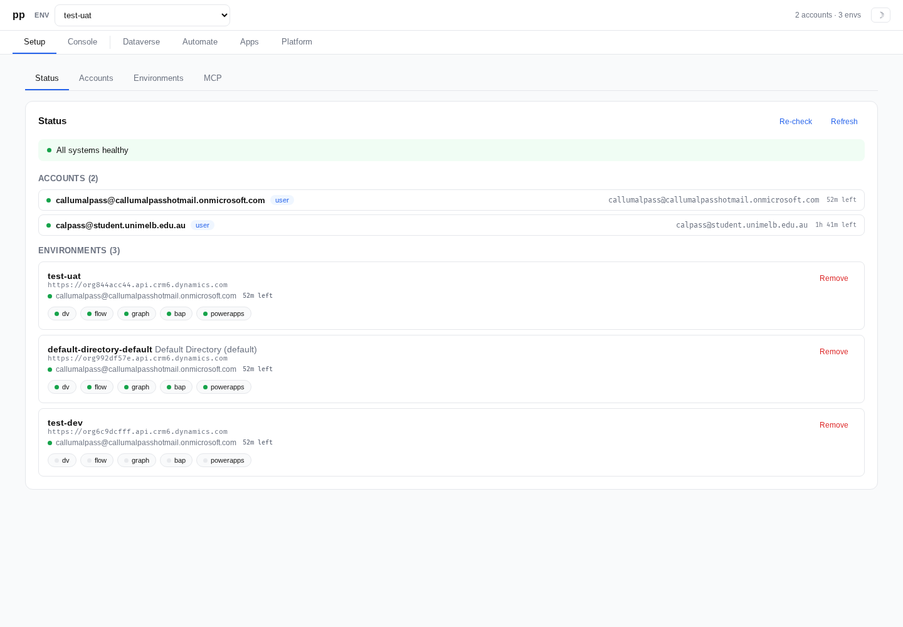
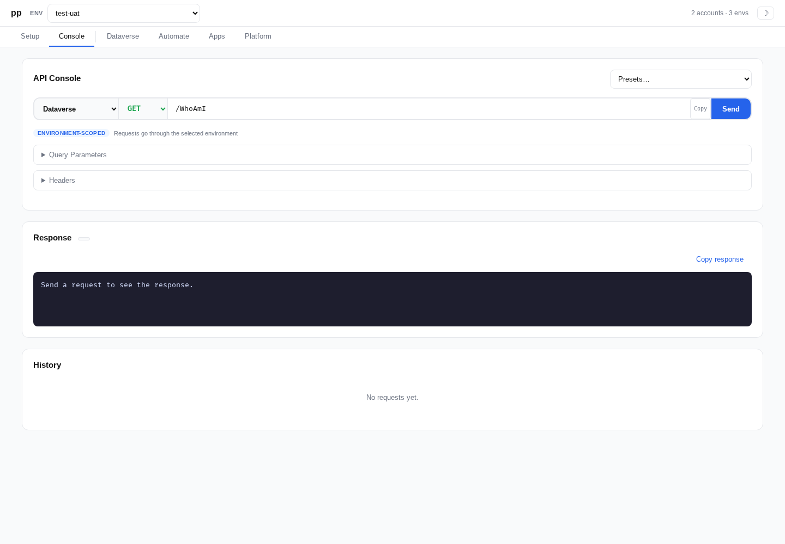
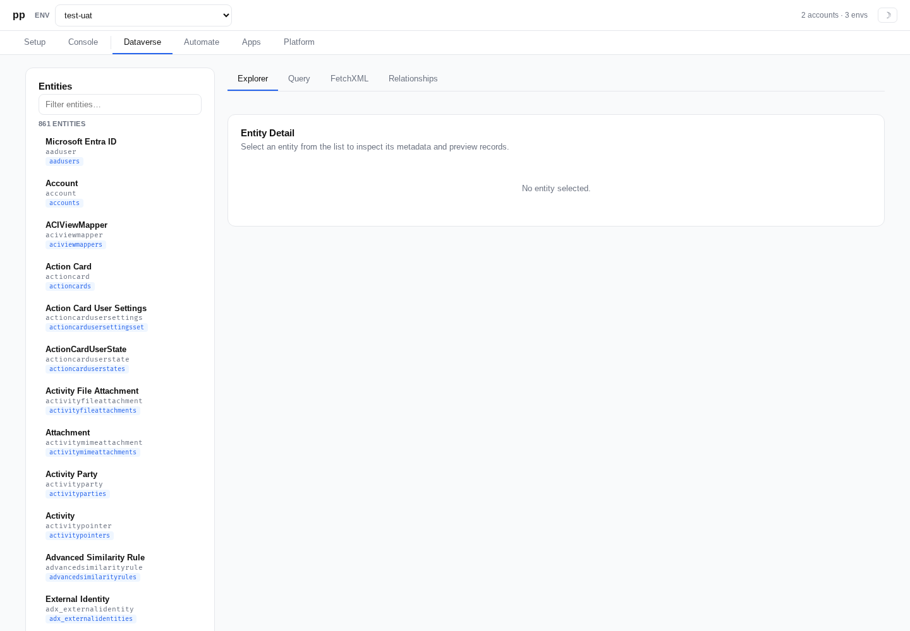

<p><svg width="48" height="48" viewBox="46 43 172 174" aria-label="pp"><mask id="pp-m"><rect x="46" y="43" width="172" height="174" fill="white"/><circle cx="100" cy="88" r="18" fill="black"/><circle cx="164" cy="88" r="18" fill="black"/></mask><g fill="black" mask="url(#pp-m)"><rect x="64" y="52" width="18" height="156" rx="9"/><circle cx="100" cy="88" r="36"/><rect x="128" y="52" width="18" height="156" rx="9"/><circle cx="164" cy="88" r="36"/></g></svg></p>

# pp

Desktop app, CLI, MCP server, and library for working with Microsoft Power Platform.

`pp` provides authenticated access to Dataverse, Power Automate, Microsoft Graph, SharePoint REST, BAP, and Power Apps APIs. It includes PP Desktop for managing accounts, environments, and Power Platform workspaces, plus an MCP server for AI assistant integration.

## Install

`pp` is distributed as three related artifacts that share the same config and auth cache:

- **PP Desktop** -- Electron app for account setup, environment management, and Power Platform workspaces.
- **CLI** -- `pp`, the command-line tool for scripted and terminal use.
- **MCP server** -- `pp-mcp`, a stdio server for AI clients.

The Windows installer can install any combination of those artifacts. The npm package installs the CLI and MCP server only.

### npm

If you already have Node.js 22+ installed:

```sh
npm install -g pp
```

Or run without a global install:

```sh
npx pp --help
```

The npm package exposes two binaries:

- `pp` for the CLI
- `pp-mcp` for the MCP server

The npm package does not include PP Desktop. Use the Windows installer for the packaged desktop app, or run Desktop from source during development.

### Windows

Download `pp-setup.exe` from the latest [GitHub Release](../../releases) and run the installer. The installer offers these components:

- **PP Desktop** installs the Electron app under `Program Files\PP\desktop` and creates a Start menu shortcut.
- **MCP server** installs `pp-mcp.exe` under `Program Files\PP` for MCP clients.
- **Command-line tools** installs `pp.exe` under `Program Files\PP`.

Leave **Add pp command-line tools to PATH** checked if you want to use `pp` and `pp-mcp` from PowerShell or from MCP client configs without a full path. If you skip PATH registration, point MCP clients at `C:\Program Files\PP\pp-mcp.exe`.

For unreleased builds, download the `pp-windows-<commit>` artifact from the latest successful CI workflow run.

PP Desktop is the recommended Windows experience. It uses the same config and auth cache as the CLI and MCP server, so accounts and environments created in one surface are available to the others. Desktop talks to its backend through Electron IPC; there is no local web server to start and no `pp ui` command.

## Quick start

Log in with a browser-based auth flow:

```sh
pp auth login myaccount
```

Add a Dataverse environment:

```sh
pp env add dev --url https://myorg.crm.dynamics.com --account myaccount
```

Verify connectivity:

```sh
pp whoami --env dev
```

Send a Dataverse request:

```sh
pp dv /accounts --env dev
```

## CLI reference

| Command | Description |
|---|---|
| `pp auth login <account>` | Create or update an account and run a login flow |
| `pp auth list` | List configured accounts |
| `pp auth inspect <account>` | Show account details |
| `pp auth remove <account>` | Remove an account |
| `pp env list` | List configured environments |
| `pp env inspect <alias>` | Show environment details |
| `pp env discover <account>` | Discover environments accessible to an account |
| `pp env add <alias>` | Add an environment (`--url URL --account ACCOUNT`) |
| `pp env remove <alias>` | Remove an environment |
| `pp request <path> --env ALIAS` | Send an authenticated API request |
| `pp whoami --env ALIAS` | Run Dataverse WhoAmI |
| `pp ping --env ALIAS` | Check API connectivity |
| `pp token --env ALIAS` | Print a bearer token |
| `pp mcp` | Start the MCP server |
| `pp migrate-config` | Migrate legacy config |
| `pp update [--check]` | Check GitHub releases for a newer version |
| `pp completion [zsh\|bash\|powershell]` | Print shell completion script |

All commands accept `--help` for usage details. Most commands accept `--config-dir DIR` to override the config location and `--no-interactive-auth` to disable browser-based auth prompts.

`pp update` checks the latest GitHub Release and prints the appropriate npm or Windows release download instructions. It does not install updates automatically.

### Auth flows

The `pp auth login` command supports multiple authentication methods:

- `--browser` (default) -- Interactive browser login via MSAL
- `--device-code` -- Device code flow for headless environments
- `--client-secret` -- Service principal auth (`--tenant-id`, `--client-id`, `--client-secret-env` required)
- `--env-token` -- Read a token from an environment variable (`--env-var` required)
- `--static-token` -- Use a fixed token string (`--token` required)

### API shortcuts

The commands `pp dv`, `pp flow`, `pp graph`, `pp sharepoint`/`pp sp`, `pp bap`, and `pp powerapps` are shortcuts for `pp request --api <type>`. They accept the same flags as `pp request`. `pp canvas-authoring` provides canvas authoring helpers and falls back to the same request shortcut when the first argument is not a helper command.

```sh
# Dataverse query
pp dv /accounts --env dev --query '$top=5'

# Graph request
pp graph /me --env dev
pp graph /me --account work

# SharePoint REST request
pp sp https://contoso.sharepoint.com/sites/site/_api/web --account work
pp sharepoint https://contoso.sharepoint.com/sites/site/_api/web/lists --env dev

# Power Automate flows
pp flow /flows --env dev

# Power Apps canvas authoring cluster discovery
pp canvas-authoring /gateway/cluster --env dev --read

# Power Apps canvas authoring session start
pp canvas-authoring session start --env dev --app <app-id>

# Fetch and validate Canvas YAML through a live authoring session
pp canvas-authoring yaml fetch --env dev --app <app-id> --out ./canvas-src
pp canvas-authoring yaml validate --env dev --app <app-id> --dir ./canvas-src

# List and describe available Canvas controls
pp canvas-authoring controls list --env dev --app <app-id>
pp canvas-authoring controls describe --env dev --app <app-id> Label

# Low-level Canvas document-server RPC
pp canvas-authoring invoke --env dev --app <app-id> --class documentservicev2 --oid 1 --method keepalive

# SignalR-backed Canvas document RPC, useful for query-style methods
pp canvas-authoring rpc --env dev --app <app-id> --class document --oid 2 --method geterrorsasync
```

Dataverse, Flow, BAP, Power Apps, Canvas Authoring, and custom requests are environment-scoped and require `--env`. Graph and SharePoint are account-scoped and can use `--account` directly; passing `--env` for those APIs is a shorthand for "use this environment's configured account".

The `--api` flag on `pp request` also accepts `custom` for arbitrary endpoints.

SharePoint REST requests require a full SharePoint URL. The token audience is the URL origin, for example `https://contoso.sharepoint.com` for `https://contoso.sharepoint.com/sites/site/_api/web`.

`canvas-authoring` targets the Power Apps canvas authoring service used by Studio and the Microsoft canvas authoring MCP server. Relative paths are rooted at the environment cluster-discovery host (`https://<encoded-environment-id>.environment.api.powerplatform.com`), so `/gateway/cluster` is the first low-level probe. Fully qualified authoring gateway URLs are preserved and authenticated with the canvas authoring resource. The `session start` helper wraps the known cluster discovery and authoring session start flow, and redacts session secrets from output unless `--raw` is provided. `session request` sends a versioned request with the active session headers; the `yaml`, `controls`, `apis`, `datasources`, and `accessibility` commands are thin wrappers around those MCP-style REST endpoints. `invoke` posts directly to `/api/v2/invoke`; `rpc` uses the authoring SignalR channel and waits for the matching document-server response.

`pp canvas-authoring yaml validate` is not a purely offline linter. It calls the live session-backed `validate-directory` endpoint; valid YAML can update the dirty draft visible in Maker/Studio, while invalid YAML returns diagnostics.

Canvas authoring is a first-party Microsoft resource that rejects pp's normal public client during interactive auth. For user and device-code accounts that do not already specify `--client-id`, pp uses the Power Apps Studio public client for `canvas-authoring` requests only, defaults that login to device code because the Studio client does not allow pp's localhost browser callback, and keeps that token in a separate cache entry so other APIs continue to use the normal pp client.

See [Canvas Authoring API notes](docs/canvas-authoring-api.md) for the observed MCP-backed YAML endpoints, session headers, and adjacent Studio APIs.

### jq response transforms

Request commands can apply a jq expression to JSON responses before printing the result:

```sh
pp dv /accounts --env dev --query '$select=name,accountid' --query '$top=50' --jq '.value | map({name, accountid})'
```

This runs jq in-process through WebAssembly; it does not shell out to a local `jq` binary. Prefer API-native filters such as `$select`, `$filter`, and `$top` first, then use `--jq` to trim or reshape the JSON that is returned.

## PP Desktop

[](docs/videos/pp-desktop-light-walkthrough.mp4)

Click the walkthrough for the full MP4.







PP Desktop provides:

- **Setup** -- Manage accounts and environments
- **Console** -- Send requests to supported Power Platform APIs
- **Dataverse** -- Browse entities and metadata, build OData queries, and execute FetchXML
- **Automate** -- Inspect Power Automate flows and runs
- **Apps** -- Inspect Power Apps inventory
- **Platform** -- Inspect platform environment metadata
- **FetchXML** -- Execute FetchXML queries

Desktop communicates with the local backend through Electron IPC. There is no public `pp ui` command and no localhost browser UI mode.

## MCP server

The MCP server exposes Power Platform operations as tools for AI assistants (e.g., Claude Desktop). It is a separate stdio process, usually launched by the MCP client. It shares pp config and auth with Desktop and the CLI.

```sh
pp mcp        # or: pp-mcp
```

Options:

- `--config-dir DIR` -- Override config directory
- `--allow-interactive-auth` -- Enable browser-based auth prompts (disabled by default in MCP mode)
- `--tool-name-style dotted|underscore` -- Expose default dotted tool names (`pp.account.list`) or Copilot-compatible underscore names (`pp_account_list`)

### Tool names

By default, tools are namespaced under `pp.`:

- `pp.account.list`, `pp.account.inspect`, `pp.account.login`, `pp.account.remove`
- `pp.environment.list`, `pp.environment.inspect`, `pp.environment.add`, `pp.environment.discover`, `pp.environment.remove`
- `pp.request`, `pp.dv_request`, `pp.flow_request`, `pp.graph_request`, `pp.sharepoint_request`, `pp.bap_request`, `pp.powerapps_request`
- `pp.whoami`, `pp.ping`, `pp.token`

When started with `--tool-name-style underscore`, dots are replaced by underscores (e.g. `pp_account_list`).

### jq in MCP tools

The request tools accept `jq` to transform JSON responses before the MCP result is returned:

```json
{
  "environment": "dev",
  "path": "/accounts",
  "query": { "$select": "name,accountid", "$top": "50" },
  "jq": ".value | map({name, accountid})"
}
```

For advanced limits, pass an object:

```json
{
  "jq": {
    "expr": ".value[] | {name, accountid}",
    "maxOutputBytes": 50000,
    "timeoutMs": 2000
  }
}
```

Use `raw: true` when the jq expression intentionally returns text instead of JSON.

### Client setup

See [docs/mcp-clients.md](docs/mcp-clients.md) for setup instructions for Claude Code, Codex CLI, GitHub Copilot CLI, and GitHub Copilot in VS Code.

## Library usage

The package exports three entry points:

### `pp` (main)

The core library for account management, environment management, and API requests.

```ts
import { listAccountSummaries, executeApiRequest } from 'pp';
```

### `pp/mcp`

Functions to create and start an MCP server programmatically.

```ts
import { createPpMcpServer, startPpMcpServer } from 'pp/mcp';

// Create a server instance
const server = createPpMcpServer({ configDir: '/path/to/config' });

// Or start with stdio transport
const { server, transport } = await startPpMcpServer();
```

### `pp/mcp-server`

Standalone MCP server entry point. Starts the server immediately on import.

## Development

### Build from source

```sh
pnpm install
pnpm build
```

This produces ESM and CJS outputs in `dist/`, including the `pp` and `pp-mcp` binaries plus the bundled PP Desktop assets under `dist/desktop/`.

Run PP Desktop from source with live rebuilds:

```sh
pnpm run dev:desktop
```

This starts Electron from `dist/desktop`, watches the Desktop main/preload code and renderer code, restarts Electron when main/preload changes, and reloads the renderer when React/UI code changes. Dev mode uses a separate Electron profile so it can run next to an installed or manually launched PP Desktop instance while still sharing the normal pp config and auth cache.

Run the Electron E2E suite with:

```sh
pnpm run test:e2e:desktop
```

On Linux this runs the Electron app under `xvfb-run` by default, so the test window does not attach to the active desktop session or steal focus. Set `PP_DESKTOP_E2E_SHOW_WINDOW=1` to run the same suite with a visible window for debugging.

### Windows packaging

Build self-contained executables with:

```sh
pnpm run build:sea
```

This emits `pp.exe` and `pp-mcp.exe` under `release/win32-x64/`. The SEA build currently runs on Windows hosts only.

Build the Electron desktop directory with:

```sh
pnpm run package:desktop
```

The SEA build emits `pp.exe` and `pp-mcp.exe` under `release/win32-x64/`. The Electron packaging step emits the desktop app under `release/electron/`. The Inno Setup installer definition at `packaging/windows/pp.iss` installs into `Program Files\PP`, offers Desktop, MCP, and CLI components, optionally adds command-line tools to `PATH`, creates a Start menu shortcut for PP Desktop, and registers uninstall support.
